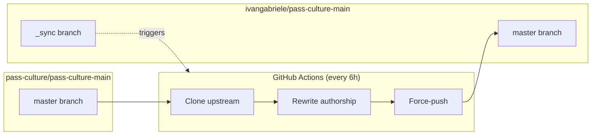

# pass-culture-main (Personal Mirror)

This repository is a personal mirror of [pass-culture/pass-culture-main](https://github.com/pass-culture/pass-culture-main).

## Why?

My company requires employees to use company-dedicated GitHub accounts for work contributions. This mirror rewrites commits authored by my company account to my personal account, allowing my work contributions to appear on my personal GitHub profile.

## How It Works



The workflow:
1. Clones the upstream repository
2. Rewrites author/committer info using `git-filter-repo` and mailmap
3. Rewrites `Co-authored-by` trailers in commit messages
4. Force-pushes to the `master` branch

## Repository Structure

| Branch | Purpose |
|--------|---------|
| `master` | Mirror of upstream with rewritten authorship |
| `_sync` (default) | Sync tooling, workflow, and documentation |

## To View the Code

Switch to the [`master`](../../tree/master) branch to browse the mirrored codebase.

## Local Setup

```bash
# Install dependencies (requires mise and uv)
mise install
uv venv && uv pip install git-filter-repo

# Run sync (dry run with last N commits)
./scripts/sync.sh --dry 50

# Run full sync (no push)
./scripts/sync.sh

# Run sync and push
./scripts/sync.sh --push
```
