---
# You can also start simply with 'default'
theme: seriph
# random image from a curated Unsplash collection by Anthony
# like them? see https://unsplash.com/collections/94734566/slidev
background: https://cover.sli.dev
# some information about your slides (markdown enabled)
title: Retex réforme crédit
info: |
  ## Slidev Starter Template
  Presentation slides for developers.

  Learn more at [Sli.dev](https://sli.dev)
# apply unocss classes to the current slide
class: text-center
# https://sli.dev/features/drawing
drawings:
  persist: false
# slide transition: https://sli.dev/guide/animations.html#slide-transitions
transition: slide-left
# enable MDC Syntax: https://sli.dev/features/mdc
mdc: true
# open graph
# seoMeta:
#  ogImage: https://cover.sli.dev
---

# Réforme des crédits des bénéficiaires

Retour d'expérience

<div class="abs-br m-6 text-xl">
  <button @click="$slidev.nav.openInEditor()" title="Open in Editor" class="slidev-icon-btn">
    <carbon:edit />
  </button>
  <a href="https://github.com/slidevjs/slidev" target="_blank" class="slidev-icon-btn">
    <carbon:logo-github />
  </a>
</div>

<!--
The last comment block of each slide will be treated as slide notes. It will be visible and editable in Presenter Mode along with the slide. [Read more in the docs](https://sli.dev/guide/syntax.html#notes)
-->

---

# Contexte

Le Ministère de la Culture réduit le crédit alloué aux bénéficiaires et la fenêtre d'éligibilité


<!--
Ne regardez que la partie du haut.
Les jeunes deviennent éligible à du crédit à partir de 17 ans.
-->

---
level: 2
---

# Ancien parcours d'activation

```mermaid {scale: 0.5}
flowchart LR
    parcours[Parcours d'activation]
    parcours --> verif{Vérification d'identité}
    verif --> KO(((Non-éligible)))
    verif --> |18 ans| credit_majeur[Création du crédit majeur]
    verif --> |entre 15 et 17 ans| credit_mineur[Création du crédit mineur]
    credit_majeur --> |2 ans plus tard| expiration(((Expiration du crédit majeur)))
    credit_mineur --> anniv_mineur(Anniversaire)
    anniv_mineur --> |entre 16 et 17 ans| recredit[Recharge du crédit]
    anniv_mineur --> |18 ans| expiration_mineur(Expiration du crédit mineur)
    recredit --> anniv_mineur
    expiration_mineur --> parcours
```

<div class="flex items-center h-80%">



<!--
Il y a deux parcours d'activation :
- le premier permet au jeune de débloquer le crédit mineur
- le crédit mineur est rechargé à chaque anniversaire
- à ses 18 ans, le jeune doit faire le 2ème parcours pour débloquer les 300€
-->

</div>

---
level: 2
---

# Nouveau parcours d'activation

```mermaid {scale: 0.42}
flowchart LR
    parcours2[Parcours d'activation]
    parcours2 --> verif2{Vérification d'identité}
    verif2 --> KO2(((Non-éligible)))
    verif2 --> |17 ou 18 ans| credit_exists{Crédit déjà créé ?}
    credit_exists --> |Non| create_credit[Création du crédit]
    credit_exists --> |Oui, pré-décret| credit_expiration[Expiration du crédit]
    credit_expiration --> create_credit
    credit_exists --> |Oui| recredit2[Recharge du crédit]
    create_credit --> recredit2
    recredit2 --> anniv(Anniversaire)
    anniv --> |18 ans| parcours2
    anniv --> |21 ans| expiration2(((Expiration du crédit)))
```

<div class="flex items-center h-80%">



<!--
Il y a toujours deux parcours d'activation :
- le premier permet au jeune de débloquer le crédit de 17 ans
- à ses 18 ans, le jeune doit faire le 2ème parcours pour débloquer les 150€
- absence de remise à zéro
-->

</div>

---

# Organisation projet

<v-clicks depth=3>

- 👪 Quasiment **toutes les équipes** du pass Culture sont parties prenantes du chantier
  - Tech, produit, interne, support, fraude, communication, marketing, finance
- 🏃 Développement réalisé dans l'**urgence**
  - ⏳️ 1.5 mois de travail au lieu des 2.5 mois cadrés
  - 🤔 Choix du binôme backend qui doit être familier avec la base de code
  - ⁉️ **Métier non-cadré** même après le début du développement
    - Réunions d'urgence avant les CODIRs et points avec le ministère
    - Responsabilisation des développeurs
    - Cas limites non-triviaux
- 😓 Mise en production avec des hauts et surtout beaucoup de bas
  - ✖️ Multiplicités et complexité des features flags
  - 💀 Mise en production un **vendredi minuit** juste parce que le 1er mars sonne bien
  - 😮‍💨 Un mois de stabilisation : bugfix & rattrapage

</v-clicks>

<!--
Responsabilisation = participation active au cadrage métier pour avoir un livrable
le plus tôt possible

Cas limites = un jeune qui commence son parcours d'activation peut mettre plusieurs
anniversaires à le finir

Où est donc passé ce mois "de trop" dans le cadrage ? Dans la peine et la douleur
-->

---

# Organisation tech

<v-clicks>

- 🧗 Montée en compétence dans l'existant et appropriation du code

- 🧑‍🤝‍🧑 Parallélisation du développement

- 📝 Mise en place d'un plan de test (quasi) exhaustif

</v-clicks>

---

# 🧗 Prise en main de l'existant

<br />

<v-clicks>

Les fonctions ont été plutôt bien compartimentées, mais l'implémentation de l'**éligibilité**
et du **crédit du bénéficiaire** est bancale

Tout peut être résumé par **un non respect des standards connus de programmation**

</v-clicks>

---
level: 2
---

# Fichiers trop gros

Ces fichiers font *trop de choses*

<br /> <br />

La taille des fichiers ralentit la navigation : on passe plus de temps à scroll le fichier plutôt qu'à le lire

<br />


```sh
$ wc -l src/pcapi/core/fraud/api.py
     779 src/pcapi/core/fraud/api.py

$ wc -l src/pcapi/core/subscription/api.py
     893 src/pcapi/core/subscription/api.py

$ wc -l src/pcapi/core/users/api.py
    2287 src/pcapi/core/users/api.py
```

---
level: 2
---

# Logique de l'éligibilité dispersée à travers plusieurs fichiers

```diff
➜ git --no-pager show 74a3de96a0b4a2c65296844475f940ac60ddfcbe --stat -- src/pcapi/core
commit 74a3de96a0b4a2c65296844475f940ac60ddfcbe
Author: Dan Nguyen <186835528+dnguyen1-pass@users.noreply.github.com>
Date:   Fri Jan 24 18:23:15 2025 +0100

    (PC-34274)[API] refactor: centralize user eligibility functions

 api/src/pcapi/core/fraud/api.py                                       |  47 +++++------------------------------------------
 api/src/pcapi/core/subscription/api.py                                |  29 +++++++++++------------------
 api/src/pcapi/core/users/api.py                                       |  59 -----------------------------------------------------------
 api/src/pcapi/core/users/eligibility_api.py                           | 123 +++++++++++++++++++++++++++++++++++++++++++++++++++++++++++++++++++++++++++++++++++++++++++++++++++++++++++++++++++++++++++
 8 files changed, 150 insertions(+), 127 deletions(-)
```

<!--
Extraction du module éligibilité
-->

---
level: 2
---

# Implémentation des crédits éloigné des standards de l'industrie

Toute implémentation devrait être au plus proche du métier que possible

<v-clicks>

Après une remarque cinglante de la part de l'équipe finance, la **comptabilité à entrée et sortie** a enfin
été implémentée :

```sql
+----------------------+----------+-------------+
| Description          | Recrédit | Réservation |
+----------------------+----------+-------------+
| Recrédit 17 ans      |    50.00 |             |  -- cette ligne n'existait pas
| Offre 1              |          | 12.34       |  -- historisation corrompue = auditabilité en souffrance
| Recrédit 18 ans      |   150.00 |             |
| Offre 2              |          | 99.99       |
+----------------------+----------+-------------+
```

Ne pas hésiter à communiquer entre département pour ~~voler~~ utiliser les bonnes implémentations


<!--
Chaque entrée et sortie correspond à un évènement dans le cycle de vie du crédit
Et d'ailleurs en parlant d'évènements...
-->

</v-clicks>

---
level: 2
---

# Le parcours d'activation est une ébauche d'**event sourcing**

Chaque changement d'état devrait être un **évènement immuable**

Ca permet d'avoir l'**historique complet**, des modèles **orientés métier** et
la capacité à **voyager dans le temps**

<div class="flex flex-justify-center flex-items-center gap-sm">

<v-clicks>


```python
def ubble_webhook_update_application_status(identification_id):
    fraud_check = ubble_fraud_api.get_ubble_fraud_check(identification_id)
    fraud_check.status = ...         # 💀 perte de l'historique
    fraud_check.resultContent = ...
```

</v-clicks>

</div>


<!--
L'historique est une aide à la prise de décision et au débug
-->

---
level: 2
---

# L'event sourcing **ne suffit pas**

Il manque une **file de messages**

<br /><br />

<v-clicks>

- Nos fournisseurs d'identité (DMS & Ubble) appellent notre webhook, en cas d'échec, on n'a **aucun mécanisme de réessai**

- Ce défaut empêche le système de *s'auto-guérir*

</v-clicks>


<!--
Absence d'auto guérison = script manuel à chaque erreur
-->

---
level: 2
---

# Les parcours d'activation auraient pu être des **machines à états finis**

**Déclarer les états/transitions** est plus simple à maintenir que les calculer de manière impérative


````md magic-move
```python
def get_user_subscription_state(user):
    if not has_validated_email(user) and not is_eligible(user):
        return EMAIL_VALIDATION

    phone_validation_status = set_phone_validation_status(user)
    if not has_validated_phone_number(user):
        return PHONE_VALIDATION

    if not has_completed_profile(user):
        return PROFILE_COMPLETION

    identity_fraud_check = set_identity_fraud_check(user)
    if not is_identity_check_ok(identity_fraud_check):
        return IDENTITY_CHECK

    if not has_completed_honor_statement(user):
        return HONOR_STATEMENT
```

```python
def get_user_subscription_state(user):
    if not has_validated_email(user) and not is_eligible(user):
        return EMAIL_VALIDATION

    if user.eligibility != EligibilityType.FREE:
        phone_validation_status = set_phone_validation_status(user)
        if not has_validated_phone_number(user):
            return PHONE_VALIDATION

    if not has_completed_profile(user):
        return PROFILE_COMPLETION

    if user.eligibility != EligibilityType.FREE:
        identity_fraud_check = set_identity_fraud_check(user)
        if not is_identity_check_ok(identity_fraud_check):
            return IDENTITY_CHECK

        if not has_completed_honor_statement(user):
            return HONOR_STATEMENT
```

```python
class EighteenSubscriptionStateMachine():
    def __init__(self, user: users_models.User):
        self.machine = transitions.Machine(model=self, states=SubscriptionStates, initial=SubscriptionStates.EMAIL_VALIDATION)

        self.machine.add_transition( 
            "proceed", SubscriptionStates.EMAIL_VALIDATION, SubscriptionStates.PHONE_VALIDATION,
            conditions=["has_validated_email", "is_eligible"], after="set_phone_validation_status",
        )
        self.machine.add_transition(
            "proceed", SubscriptionStates.PHONE_VALIDATION, SubscriptionStates.PROFILE_COMPLETION,
            conditions="has_validated_phone_number",
        )
        self.machine.add_transition(
            "proceed", SubscriptionStates.PROFILE_COMPLETION, SubscriptionStates.IDENTITY_CHECK,
            conditions="has_completed_profile", after="set_identity_fraud_check",
        )
        self.machine.add_transition(
            "proceed", SubscriptionStates.IDENTITY_CHECK, SubscriptionStates.HONOR_STATEMENT,
            conditions="is_identity_check_ok",
        )
        self.machine.add_transition(
            "proceed", SubscriptionStates.HONOR_STATEMENT, SubscriptionStates.SUBSCRIPTION_COMPLETED_BUT_NOT_BENEFICIARY_YET,
            conditions=["has_completed_honor_statement", "is_identity_check_ok"],
        )
```

```python
class FreeSubscriptionStateMachine():
    def __init__(self, user: users_models.User):
        self.machine = transitions.Machine(
            model=self, states=SubscriptionStates, initial=SubscriptionStates.EMAIL_VALIDATION, model_override=True
        )
        self.machine.add_transition( 
            "proceed", SubscriptionStates.EMAIL_VALIDATION, SubscriptionStates.PROFILE_COMPLETION,
            conditions=["has_validated_email", "is_eligible"],
        )
        self.machine.add_transition(
            "proceed", SubscriptionStates.HONOR_STATEMENT, SubscriptionStates.SUBSCRIPTION_COMPLETED_BUT_NOT_BENEFICIARY_YET,
            conditions="has_completed_profile",
        )
```
````

<!--
Déclaratif = logique aplatie, plus simple de définir des nouvelles machines plutôt que
marteler une fonction avec encore plus de `if`
Les machines sont décorrellées
La validation d'une transition d'un état à l'autre se fait de manière automatique sans boilerplate
Exemple: pas de `PHONE_VALIDATION` dans le nouveau parcours d'activation -> une erreur serait levée
-->

---
level: 2
---

# Absence de **fuseau horaire** sur la plupart des dates

Il est toujours minuit *quelque part*

<br /> <br /> <br />

<v-clicks>

On aurait pu éviter la panique de la mise en production qui ne "fonctionnait pas"...

Il fallait attendre minuit UTC, c'est-à-dire 1h du matin heure de Paris

</v-clicks>

---
layout: center
---

# 🧑‍🤝‍🧑 Parallélisation du développement

Deux axes de complexité ont rapidement été identifiés : l'**éligibilité** et le **crédit**

---
level: 2
layout: center
---

# Cas limites nombreux

Tous les cas limites ont été découverts lors du *branchement de l'éligibilité et du crédit*

---
level: 3
---

# Transition pré à post-décret

Source de beaucoup de complexité


---
level: 3
---

# Les deux concepts ne sont pas si découplés que ça finalement

Que ce soit dans le code ou dans le métier

<v-click>

Il aurait été plus simple et plus agile de traiter chaque cas limite de bout en bout

</v-click>

---
level: 2
---

# 📝 Mise en place d'un plan de test (quasi) exhaustif

Le TDD niveau métier


<!--
Au moins 6 personnes connaissent les parcours d'activation sur le bout des doigts
-->

---
level: 3
---

# Les conditions de course non-testables à 5 utilisateurs

Si un bug arrive 1% du temps, il arrivera tous les jours avec 1M d'utilisateurs


<br />

<v-clicks depth=2>

- plusieurs points d'entrée modifie la même ressource
  - DMS spam notre webhook / double clic
  - le cron de recrédit peut se déclencher en même temps que le jeune finit son deux parcours
    d'activation
- les points d'entrées ne sont pas idempotentes
  - `upsert_deposit` : expire un crédit, crée un crédit et/ou recrédite le jeune

</v-clicks>

---
layout: end
---

# Chantier intéressant techniquement

Eprouvant humainement

<!--
Qui souligne beaucoup de travail à faire pour être robuste...
-->

---


# Navigation

Hover on the bottom-left corner to see the navigation's controls panel, [learn more](https://sli.dev/guide/ui#navigation-bar)

## Keyboard Shortcuts

|                                                     |                             |
| --------------------------------------------------- | --------------------------- |
| <kbd>right</kbd> / <kbd>space</kbd>                 | next animation or slide     |
| <kbd>left</kbd>  / <kbd>shift</kbd><kbd>space</kbd> | previous animation or slide |
| <kbd>up</kbd>                                       | previous slide              |
| <kbd>down</kbd>                                     | next slide                  |

<!-- https://sli.dev/guide/animations.html#click-animation -->

<p v-after class="absolute bottom-23 left-45 opacity-30 transform -rotate-10">Here!</p>

---
layout: two-cols
layoutClass: gap-16
---

# Table of contents

You can use the `Toc` component to generate a table of contents for your slides:

```html
<Toc minDepth="1" maxDepth="1" />
```

The title will be inferred from your slide content, or you can override it with `title` and `level` in your frontmatter.

::right::

<Toc text-sm minDepth="1" maxDepth="2" />

---
layout: image-right
image: https://cover.sli.dev
---

# Code

Use code snippets and get the highlighting directly, and even types hover!

```ts {all|5|7|7-8|10|all} twoslash
// TwoSlash enables TypeScript hover information
// and errors in markdown code blocks
// More at https://shiki.style/packages/twoslash

import { computed, ref } from 'vue'

const count = ref(0)
const doubled = computed(() => count.value * 2)

doubled.value = 2
```

<arrow v-click="[4, 5]" x1="350" y1="310" x2="195" y2="334" color="#953" width="2" arrowSize="1" />

<!-- This allow you to embed external code blocks -->
<<< @/snippets/external.ts#snippet

<!-- Footer -->

[Learn more](https://sli.dev/features/line-highlighting)

<!-- Inline style -->
<style>
.footnotes-sep {
  @apply mt-5 opacity-10;
}
.footnotes {
  @apply text-sm opacity-75;
}
.footnote-backref {
  display: none;
}
</style>

<!--
Notes can also sync with clicks

[click] This will be highlighted after the first click

[click] Highlighted with `count = ref(0)`

[click:3] Last click (skip two clicks)
-->

---
level: 2
---

# Shiki Magic Move

Powered by [shiki-magic-move](https://shiki-magic-move.netlify.app/), Slidev supports animations across multiple code snippets.

Add multiple code blocks and wrap them with <code>````md magic-move</code> (four backticks) to enable the magic move. For example:

````md magic-move {lines: true}
```ts {*|2|*}
// step 1
const author = reactive({
  name: 'John Doe',
  books: [
    'Vue 2 - Advanced Guide',
    'Vue 3 - Basic Guide',
    'Vue 4 - The Mystery'
  ]
})
```

```ts {*|1-2|3-4|3-4,8}
// step 2
export default {
  data() {
    return {
      author: {
        name: 'John Doe',
        books: [
          'Vue 2 - Advanced Guide',
          'Vue 3 - Basic Guide',
          'Vue 4 - The Mystery'
        ]
      }
    }
  }
}
```

```ts
// step 3
export default {
  data: () => ({
    author: {
      name: 'John Doe',
      books: [
        'Vue 2 - Advanced Guide',
        'Vue 3 - Basic Guide',
        'Vue 4 - The Mystery'
      ]
    }
  })
}
```

Non-code blocks are ignored.

```vue
<!-- step 4 -->
<script setup>
const author = {
  name: 'John Doe',
  books: [
    'Vue 2 - Advanced Guide',
    'Vue 3 - Basic Guide',
    'Vue 4 - The Mystery'
  ]
}
</script>
```
````

---

# Components

<div grid="~ cols-2 gap-4">
<div>

You can use Vue components directly inside your slides.

We have provided a few built-in components like `<Tweet/>` and `<Youtube/>` that you can use directly. And adding your custom components is also super easy.

```html
<Counter :count="10" />
```

<!-- ./components/Counter.vue -->
<Counter :count="10" m="t-4" />

Check out [the guides](https://sli.dev/builtin/components.html) for more.

</div>
<div>

```html
<Tweet id="1390115482657726468" />
```

<Tweet id="1390115482657726468" scale="0.65" />

</div>
</div>

<!--
Presenter note with **bold**, *italic*, and ~~striked~~ text.

Also, HTML elements are valid:
<div class="flex w-full">
  <span style="flex-grow: 1;">Left content</span>
  <span>Right content</span>
</div>
-->

---
class: px-20
---

# Themes

Slidev comes with powerful theming support. Themes can provide styles, layouts, components, or even configurations for tools. Switching between themes by just **one edit** in your frontmatter:

<div grid="~ cols-2 gap-2" m="t-2">

```yaml
---
theme: default
---
```

```yaml
---
theme: seriph
---
```


</div>

Read more about [How to use a theme](https://sli.dev/guide/theme-addon#use-theme) and
check out the [Awesome Themes Gallery](https://sli.dev/resources/theme-gallery).

---

# Clicks Animations

You can add `v-click` to elements to add a click animation.

<div v-click>

This shows up when you click the slide:

```html
<div v-click>This shows up when you click the slide.</div>
```

</div>

<br>

<v-click>

The <span v-mark.red="3"><code>v-mark</code> directive</span>
also allows you to add
<span v-mark.circle.orange="4">inline marks</span>
, powered by [Rough Notation](https://roughnotation.com/):

```html
<span v-mark.underline.orange>inline markers</span>
```

</v-click>

<div mt-20 v-click>

[Learn more](https://sli.dev/guide/animations#click-animation)

</div>

---

# Motions

Motion animations are powered by [@vueuse/motion](https://motion.vueuse.org/), triggered by `v-motion` directive.

```html
<div
  v-motion
  :initial="{ x: -80 }"
  :enter="{ x: 0 }"
  :click-3="{ x: 80 }"
  :leave="{ x: 1000 }"
>
  Slidev
</div>
```

<div class="w-60 relative">
  <div class="relative w-40 h-40">
    
    
    
  </div>

  <div
    class="text-5xl absolute top-14 left-40 text-[#2B90B6] -z-1"
    v-motion
    :initial="{ x: -80, opacity: 0}"
    :enter="{ x: 0, opacity: 1, transition: { delay: 2000, duration: 1000 } }">
    Slidev
  </div>
</div>

<!-- vue script setup scripts can be directly used in markdown, and will only affects current page -->
<script setup lang="ts">
const final = {
  x: 0,
  y: 0,
  rotate: 0,
  scale: 1,
  transition: {
    type: 'spring',
    damping: 10,
    stiffness: 20,
    mass: 2
  }
}
</script>

<div
  v-motion
  :initial="{ x:35, y: 30, opacity: 0}"
  :enter="{ y: 0, opacity: 1, transition: { delay: 3500 } }">

[Learn more](https://sli.dev/guide/animations.html#motion)

</div>

---

# LaTeX

LaTeX is supported out-of-box. Powered by [KaTeX](https://katex.org/).

<div h-3 />

Inline $\sqrt{3x-1}+(1+x)^2$

Block
$$ {1|3|all}
\begin{aligned}
\nabla \cdot \vec{E} &= \frac{\rho}{\varepsilon_0} \\
\nabla \cdot \vec{B} &= 0 \\
\nabla \times \vec{E} &= -\frac{\partial\vec{B}}{\partial t} \\
\nabla \times \vec{B} &= \mu_0\vec{J} + \mu_0\varepsilon_0\frac{\partial\vec{E}}{\partial t}
\end{aligned}
$$

[Learn more](https://sli.dev/features/latex)

---

# Diagrams

You can create diagrams / graphs from textual descriptions, directly in your Markdown.

```mermaid {scale: 0.5, alt: 'A simple sequence diagram'}
flowchart TD
    Inscription --> parcours[Parcours d'activation]
    parcours --> verif{Vérification d'identité}
    verif --> KO(((Non-éligible)))
    verif --> |entre 15 et 18 ans| age{Âge au début du parcours}
    age --> |18 ans| credit_majeur[Création du crédit majeur]
    credit_majeur --> |2 ans plus tard| expiration(((Expiration du crédit majeur)))
    age --> |entre 15 et 17 ans| credit_mineur[Création du crédit mineur]
    credit_mineur --> anniv_mineur(Anniversaire)
    anniv_mineur --> age_mineur@{shape: loop-limit, label: "Âge"}
    age_mineur --> |entre 16 et 17 ans| recredit[Recharge du crédit]
    age_mineur --> |18 ans| expiration_mineur(Expiration du crédit mineur)
    recredit --> anniv_mineur
    expiration_mineur --> parcours
```

<div class="grid grid-cols-4 gap-5 pt-4 -mb-6">




</div>

Learn more: [Mermaid Diagrams](https://sli.dev/features/mermaid) and [PlantUML Diagrams](https://sli.dev/features/plantuml)

---
foo: bar
dragPos:
  square: 691,32,167,_,-16
---

# Draggable Elements

Double-click on the draggable elements to edit their positions.

<br>

###### Directive Usage

```md

```

<br>

###### Component Usage

```md
<v-drag text-3xl>
  <div class="i-carbon:arrow-up" />
  Use the `v-drag` component to have a draggable container!
</v-drag>
```

<v-drag pos="663,206,261,_,-15">
  <div text-center text-3xl border border-main rounded>
    Double-click me!
  </div>
</v-drag>


###### Draggable Arrow

```md
<v-drag-arrow two-way />
```

<v-drag-arrow pos="67,452,253,46" two-way op70 />

---
src: ./pages/imported-slides.md
hide: false
---

---

# Monaco Editor

Slidev provides built-in Monaco Editor support.

Add `{monaco}` to the code block to turn it into an editor:

```ts {monaco}
import { ref } from 'vue'
import { emptyArray } from './external'

const arr = ref(emptyArray(10))
```

Use `{monaco-run}` to create an editor that can execute the code directly in the slide:

```ts {monaco-run}
import { version } from 'vue'
import { emptyArray, sayHello } from './external'

sayHello()
console.log(`vue ${version}`)
console.log(emptyArray<number>(10).reduce(fib => [...fib, fib.at(-1)! + fib.at(-2)!], [1, 1]))
```

---
layout: center
class: text-center
---

# Learn More

[Documentation](https://sli.dev) · [GitHub](https://github.com/slidevjs/slidev) · [Showcases](https://sli.dev/resources/showcases)

<PoweredBySlidev mt-10 />
